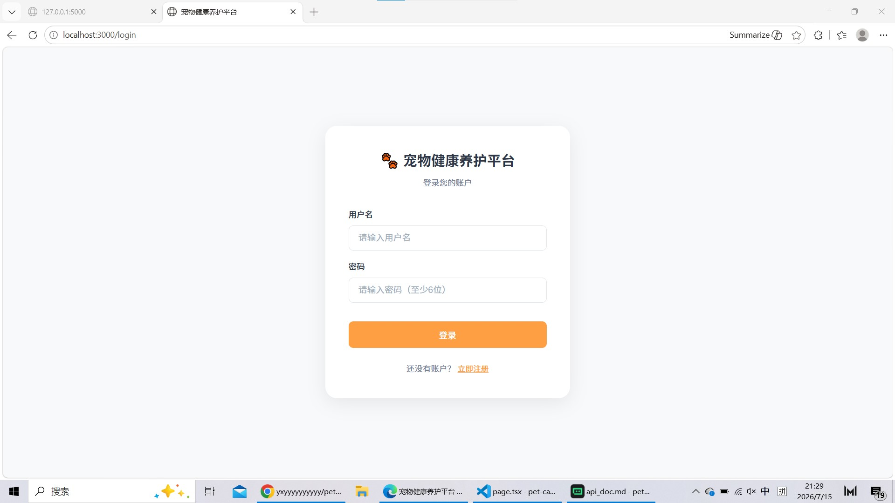
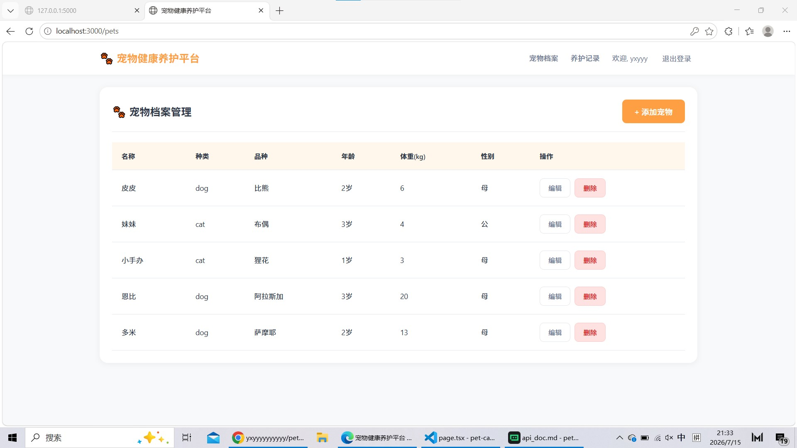
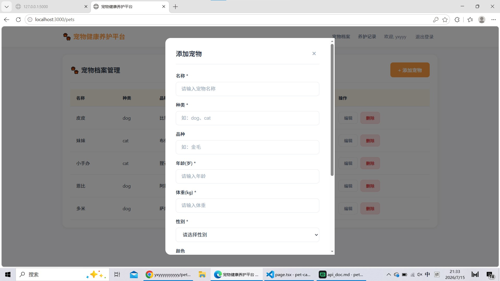
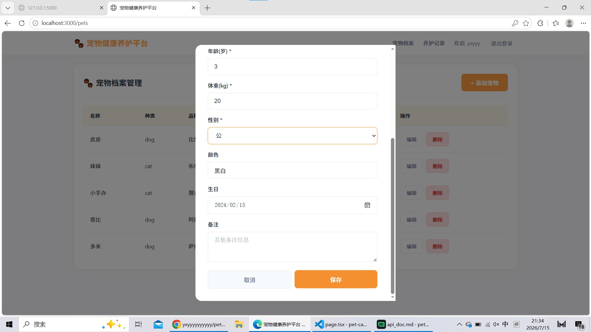
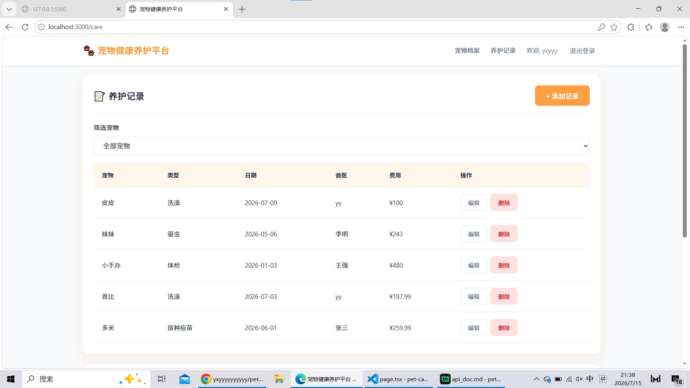
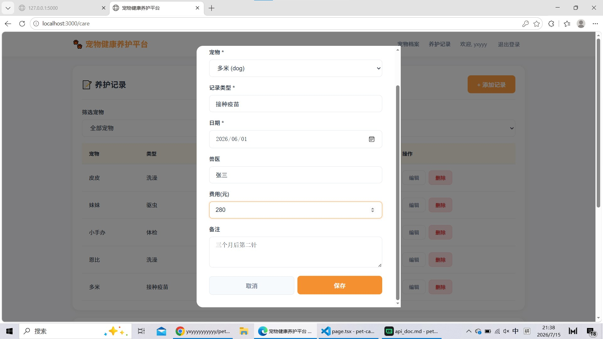
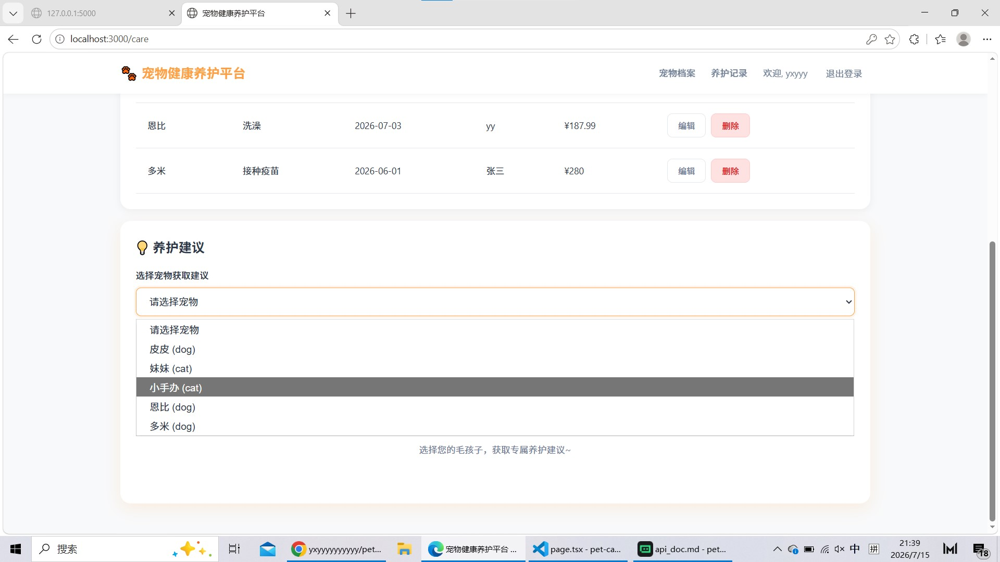
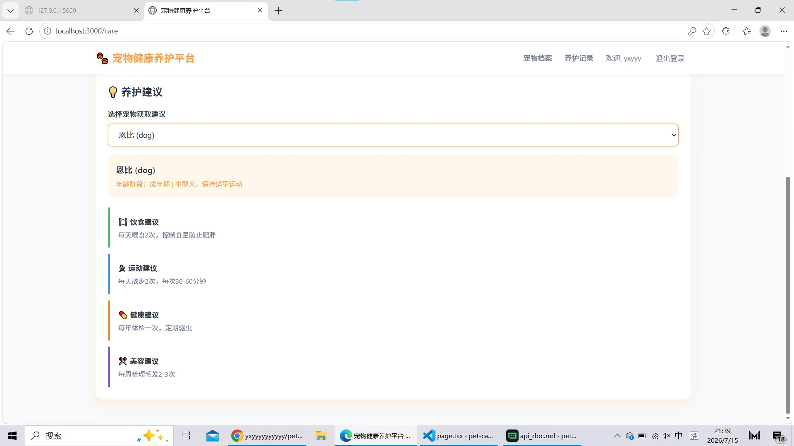

# 宠物健康养护平台

基于 Next.js (App Router) + Flask 的全栈宠物健康养护管理平台。

## 项目简介

本平台旨在为宠物主人提供一站式宠物健康管理服务，支持宠物档案管理、养护记录追踪及智能养护建议生成。采用前后端分离架构，前端使用 Next.js 14 构建现代化用户界面，后端使用 Flask 提供 RESTful API 服务，数据存储采用 SQLite 轻量级数据库。

## 功能列表

### 用户认证
- 用户注册与登录
- JWT Token 身份验证
- 登录状态持久化

### 宠物档案管理
- 宠物信息增删改查
- 支持录入宠物品种、年龄、体重、性别、生日等信息
- 宠物列表展示与筛选

### 养护记录管理
- 养护记录增删改查
- 记录类型、日期、兽医、费用等信息录入
- 按宠物筛选养护记录

### 智能养护建议
- 根据宠物品种、年龄、体重生成个性化养护建议
- 涵盖饮食、运动、健康、美容四大维度

## 项目功能展示

#### 1. 登录页面


#### 2. 宠物档案列表页面


#### 3. 新增宠物弹窗


#### 4. 编辑宠物弹窗


#### 5. 养护记录主页


#### 6. 添加养护记录弹窗


#### 7. 宠物下拉选择界面


#### 8. 养护建议展示区域


## 技术栈

### 前端
- Next.js 14 (App Router)
- React 18
- TypeScript
- Axios
- CSS3

### 后端
- Flask 2.3.3
- Flask-SQLAlchemy 3.1.1
- Flask-JWT-Extended 4.5.3
- Flask-CORS 4.0.0
- SQLite

### 开发工具
- VS Code
- npm
- pip

## 目录结构

```
pet-care-platform/
├── frontend/                    # Next.js 前端应用
│   ├── app/                     # 页面路由
│   │   ├── login/               # 登录页面
│   │   │   └── page.tsx
│   │   ├── pets/                # 宠物档案管理页面
│   │   │   └── page.tsx
│   │   ├── care/                # 养护记录与建议页面
│   │   │   └── page.tsx
│   │   ├── layout.tsx           # 全局布局
│   │   └── page.tsx             # 首页
│   ├── components/              # 公共组件
│   │   ├── Layout.tsx           # 导航布局
│   │   ├── AuthGuard.tsx        # 认证守卫
│   │   ├── Modal.tsx            # 弹窗组件
│   │   └── Alert.tsx            # 提示组件
│   ├── lib/                     # 请求工具
│   │   └── api.ts               # API 封装
│   ├── styles/                  # 全局样式
│   │   └── globals.css
│   ├── .env                     # 环境变量配置
│   ├── .env.local               # 本地环境变量配置
│   ├── netlify.toml             # Netlify 部署配置
│   ├── next.config.js           # Next.js 配置
│   ├── tsconfig.json            # TypeScript 配置
│   ├── package.json             # 依赖配置
│   └── package-lock.json        # 依赖锁文件
├── backend/                     # Flask 后端应用
│   ├── models/                  # 数据库模型
│   │   ├── __init__.py
│   │   ├── user.py              # 用户模型
│   │   ├── pet.py               # 宠物模型
│   │   └── care_record.py       # 养护记录模型
│   ├── routes/                  # 路由模块
│   │   ├── __init__.py
│   │   ├── auth.py              # 认证接口
│   │   ├── pets.py              # 宠物接口
│   │   └── care.py              # 养护接口
│   ├── utils/                   # 工具函数
│   │   ├── __init__.py
│   │   ├── decorators.py        # 验证装饰器
│   │   └── error_handler.py     # 全局异常处理
│   ├── instance/                # SQLite 数据库目录
│   │   └── pet_care.db          # 数据库文件
│   ├── app.py                   # 应用入口
│   ├── extensions.py            # 扩展初始化
│   ├── render.yaml              # Render 部署配置
│   ├── .env                     # 环境变量配置
│   └── requirements.txt         # 依赖清单
├── docs/                        # 项目文档
│   ├── 项目总结.md               # 项目开发总结
│   ├── 个人实训总结报告.md        # 个人实训报告
│   ├── api_doc.md               # API 接口文档
│   └── 调试日志.md               # 调试记录
├── screenshots/                 # 截图文件夹
│   ├── login.jpg                # 登录页面截图
│   ├── pet_list.jpg             # 宠物列表截图
│   ├── pet_add_modal.jpg        # 新增宠物弹窗截图
│   ├── pet_edit_modal.jpg       # 编辑宠物弹窗截图
│   ├── care_page.jpg            # 养护记录主页截图
│   ├── care_add_modal.jpg       # 添加养护记录弹窗截图
│   ├── care_select.jpg          # 宠物选择下拉框截图
│   └── care_suggestion.jpg      # 养护建议展示截图
├── videos/                      # 项目演示录屏
│   └── 演示视频.mp4             # 项目功能演示视频
├── .gitattributes               # Git LFS 配置
├── backend.zip                  # 后端代码压缩包
├── prompt_log.md                # AI 协作记录
└── README.md                    # 项目说明
```

## 环境配置

### 环境要求
- Node.js >= 18.0.0
- Python >= 3.8.0

### 后端配置

进入 `backend` 目录，安装依赖：

```bash
cd backend
pip install -r requirements.txt
```

后端默认配置：
- 服务端口：5000
- 数据库：SQLite (自动创建于 `backend/instance/pet_care.db`)
- JWT Token 过期时间：30 分钟

### 前端配置

进入 `frontend` 目录，安装依赖：

```bash
cd frontend
npm install
```

前端默认配置：
- 服务端口：3001（通过 `PORT=3001 npm run dev` 指定）
- API 地址：`http://localhost:5000/api`

## 启动教程

### 启动后端服务

```bash
cd backend
python app.py
```

后端服务运行在 `http://localhost:5000`

### 启动前端服务

```bash
cd frontend
npm run dev
```

前端服务运行在 `http://localhost:3001`

### 访问应用

打开浏览器访问 `http://localhost:3001`，即可使用宠物健康养护平台。

## API 接口

### 用户认证
- `POST /api/auth/register` - 用户注册
- `POST /api/auth/login` - 用户登录

### 宠物管理
- `GET /api/pets` - 获取宠物列表
- `POST /api/pets` - 创建宠物
- `GET /api/pets/:id` - 获取宠物详情
- `PUT /api/pets/:id` - 更新宠物
- `DELETE /api/pets/:id` - 删除宠物

### 养护记录
- `GET /api/care/records` - 获取养护记录列表
- `POST /api/care/records` - 创建养护记录
- `GET /api/care/records/:id` - 获取记录详情
- `PUT /api/care/records/:id` - 更新养护记录
- `DELETE /api/care/records/:id` - 删除养护记录
- `GET /api/care/advice/:pet_id` - 获取养护建议

## 部署说明

本项目曾尝试线上部署（前端静态部署到 Netlify、后端服务部署到 PythonAnywhere），但在实际部署过程中遇到以下问题：

1. **跨域配置冲突**：前端请求携带凭证时与后端 CORS 配置不一致，导致跨域预检失败
2. **接口路径不匹配**：前端登录/注册请求缺少 `/api` 前缀，与后端路由不匹配
3. **免费平台限制**：PythonAnywhere 免费实例存在资源限制和 CPU 时间配额
4. **环境变量配置复杂**：Netlify 环境变量与本地开发环境差异较大，调试困难

**当前状态**：项目已恢复为纯本地开发模式，CORS 配置为最简通用模式，可直接在本地运行。

**部署验证替代方案**：根据考核细则要求，因后端服务线上部署失败，使用项目演示录屏（`videos/演示视频.mp4`）作为替代验证方式。视频中完整展示了：
- 本地启动前后端服务
- 用户登录功能
- 宠物档案管理功能（新增、编辑、删除、查看）
- 养护记录与养护建议功能

## 注意事项

1. 首次运行需先启动后端服务，数据库将自动创建于 `backend/instance/pet_care.db`
2. 生产环境需修改 `SECRET_KEY` 和 `JWT_SECRET_KEY`
3. 当前 CORS 配置为 `origins="*"`，仅适合本地开发环境
4. 所有接口需携带有效的 JWT Token（登录后自动获取并存储于 localStorage）
5. 前端默认运行端口为 3000，也可通过 `PORT` 环境变量指定（如 `PORT=3001 npm run dev`）
